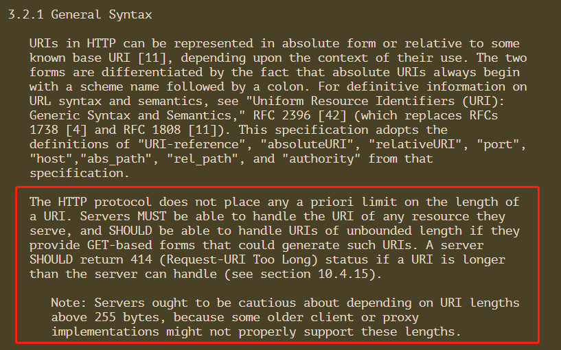
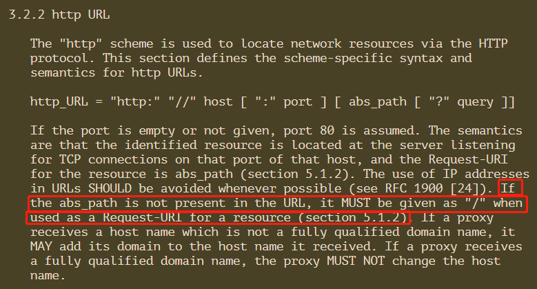
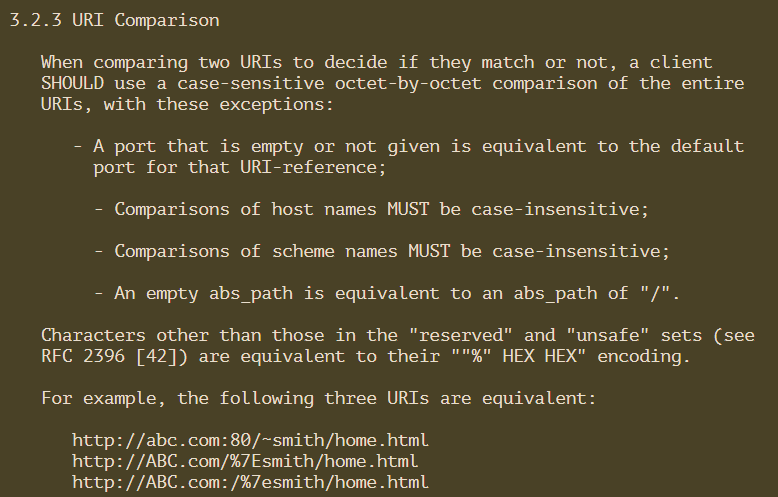
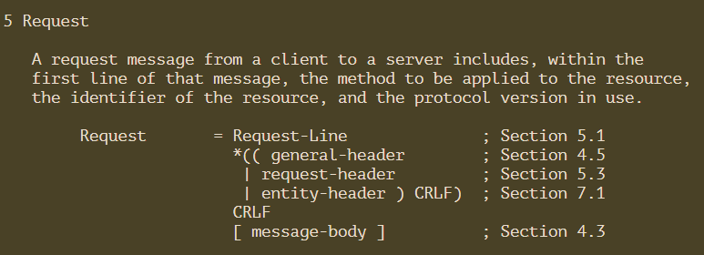
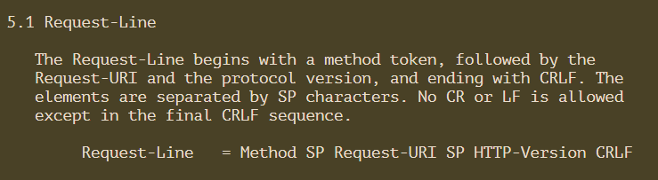
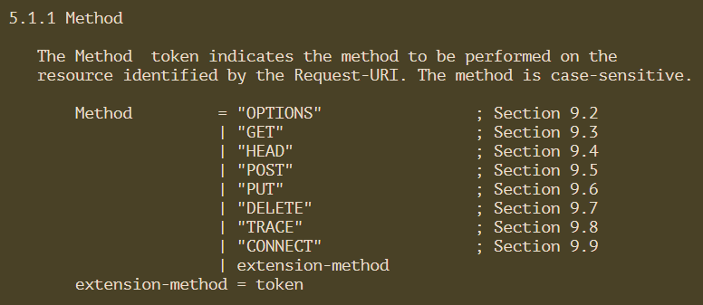
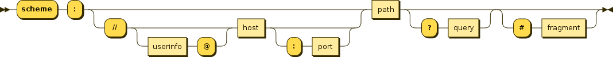
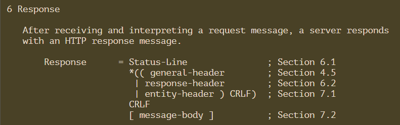
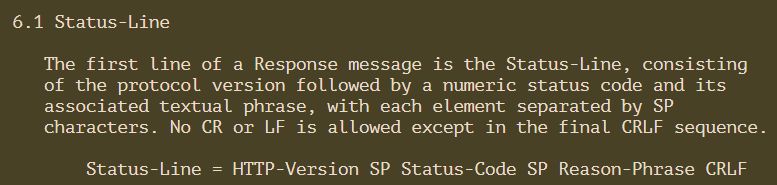

# 3.2.1 General Syntax

> HTTP协议对URI的长度没有任何预先限制。服务器必须能够处理它们服务的任何资源的URI，并且应该能够处理无限长度的URI，如果它们提供了基于get的表单，可以生成这样的URI。如果一个URI超过了服务器的处理能力，服务器应该返回414 (Request-URI Too Long)状态(参见10.4.15节)。
>
> 注意:服务器应该谨慎对待大于255字节的URI长度，因为一些旧的客户机或代理实现可能不正确地支持这些长度。

# 3.2.2 http URL

> 如果abs_path在URL中不存在，当它被用作资源的Request-URI时，它必须被指定为"/"(章节5.1.2)。

# 3.2.3 URI Comparison

> 比较规则
> - 主机名的比较必须不区分大小写
> - 模式名的比较必须不区分大小写
> - 空的abs_path等价于“/”的abs_path

> 下列3个url等效（默认80端口）
> - **http://abc.com:80/~smith/home.html**
> - **http://ABC.com/%7Esmith/home.html**
> - **http://ABC.com:/%7esmith/home.html**

# 5 Request

> 这是一个http请求具体的样子

> 这是请求行的样子
>
> SP ==> space 空格符
>
> CRLF 互联网标准换行 ==> CR 回车符 + LF 换行符

# http协议这些SP、CRLF的规范来源

**巴科斯范式(BNF: Backus-Naur Form 的缩写)**
*[随便找的参考链接](https://my.liyunde.com/backus-naur-form-bnf/)*
> 巴科斯范式(BNF: Backus-Naur Form 的缩写)是由 John Backus 和 Peter Naur 首先引入的用来描述计算机语言语法的符号集。现在，几乎每一位新编程语言书籍的作者都使用巴科斯范式来定义编程语言的语法规则。

# 5.1.1 Method

# 5.1.2 Request-URI

# 6 Response

> 这是一个http返回具体的样子

# 6.1 Status-Line

> - Status-Code 元素是一个3位整数，表示试图理解和满足请求的结果代码。**供自动机使用**
> - Reason-Phrase 旨在给出状态代码的简短文本描述。**供人类用户使用**。客户端不需要检查或显示原因-短语。